# Data Platform MVP · 数据中台

<p align="center">
  
  
  
  
  
</p>

> 面向中小团队的轻量级一站式数据中台，覆盖数据集成、代码开发、调度编排、数据资产全链路。

---

## 目录

- [功能概览](#功能概览)
- [技术架构](#技术架构)
- [快速开始](#快速开始)
  - [环境要求](#环境要求)
  - [一键部署](#一键部署)
  - [环境变量](#环境变量)
- [本地开发](#本地开发)
  - [后端](#后端)
  - [前端](#前端)
- [核心功能](#核心功能)
  - [数据集成](#数据集成--离线同步)
  - [代码开发](#代码开发--ide)
  - [调度中心](#调度中心)
  - [数据资产](#数据资产)
- [API 文档](#api-文档)
- [常见问题](#常见问题)
- [设计取舍](#设计取舍)
- [安全注意事项](#安全注意事项)
- [License](#license)

---

## 功能概览

| 模块 | 说明 |
|---|---|
| **工作台** | 任务运行概览、调度日历、成功率趋势 |
| **数据集成** | 多数据源管理（MySQL），向导式离线同步任务，DataX 驱动 |
| **代码开发** | 多标签 SQL/Python/Shell IDE，Monaco Editor，表名/字段智能补全 |
| **调度中心** | 基于 DolphinScheduler，工作流可视化，补数/重跑 |
| **数据资产** | 表资产、字段资产、数据血缘（OpenMetadata） |
| **系统监控** | 各服务健康状态、DS Worker 资源占用 |

<details>
<summary>点击查看截图</summary>

### 数据源管理
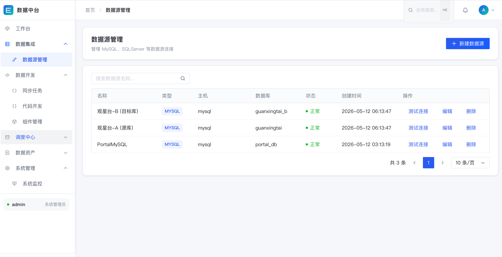

### 同步任务 · 字段映射
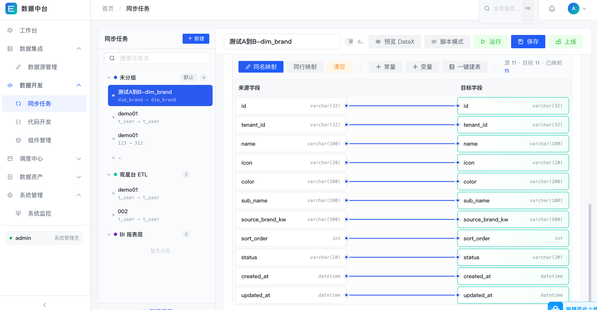

### 同步任务 · 配置
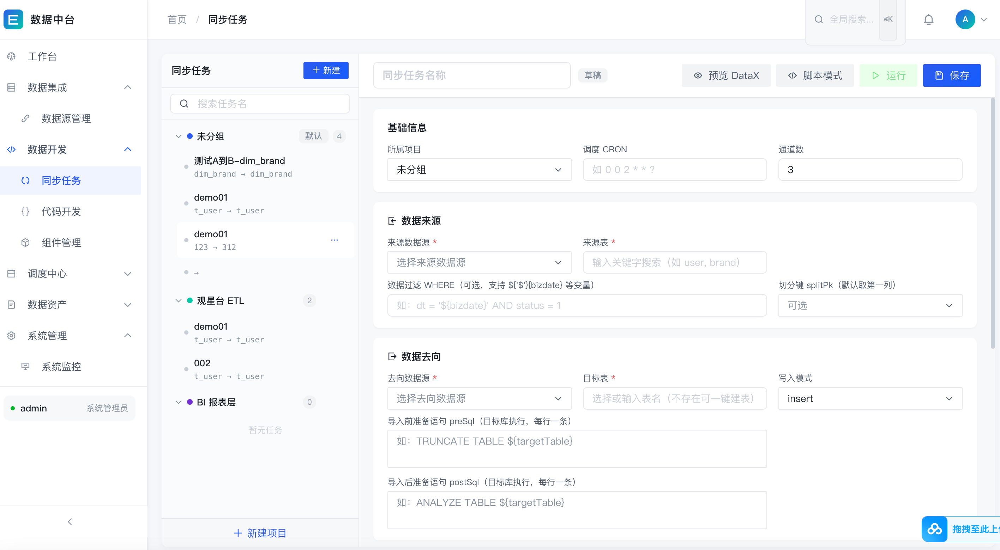

### 代码开发 · SQL IDE
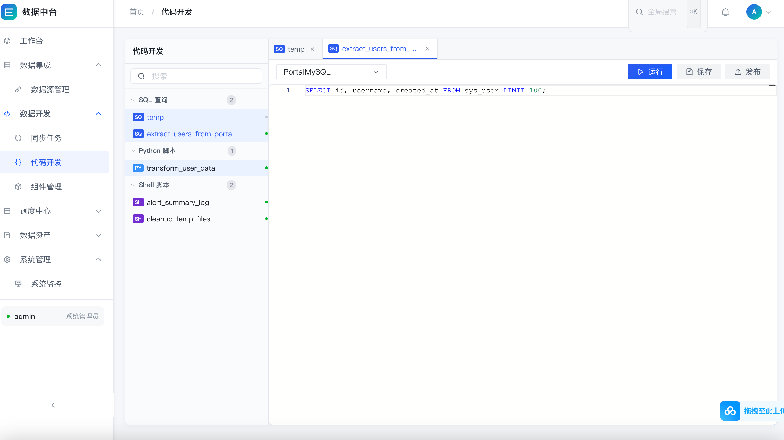

### 组件管理
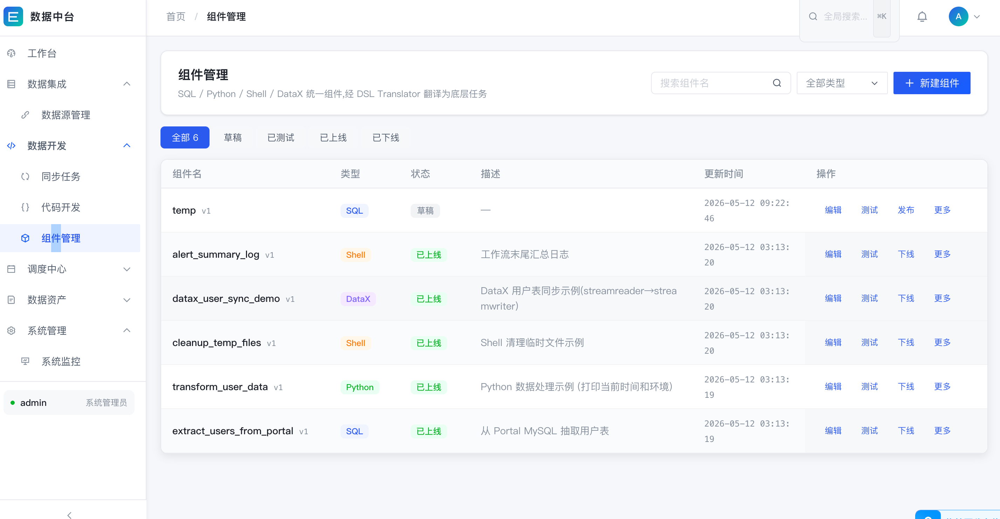

### 工作流管理
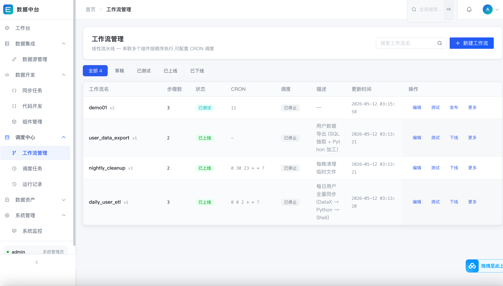

### 工作流编辑
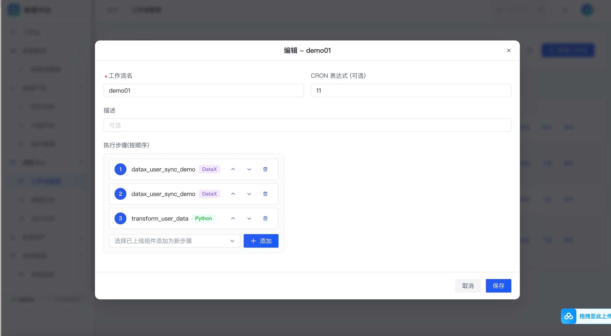

### 运行记录
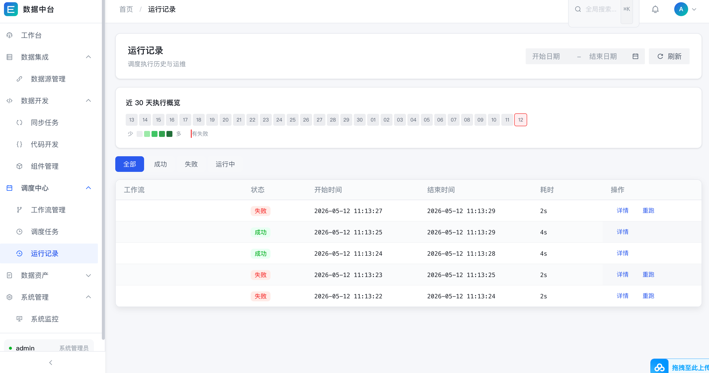

### 数据血缘
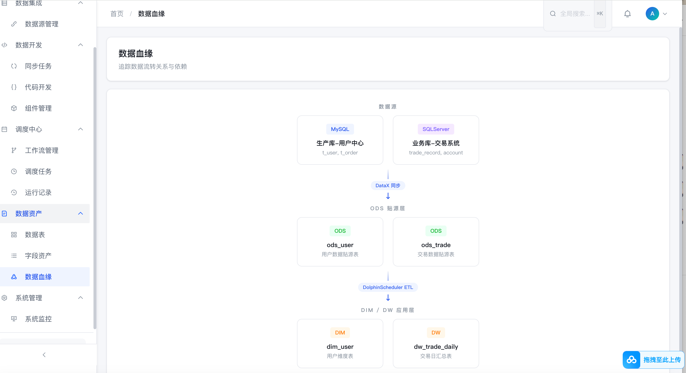

### 数据资产
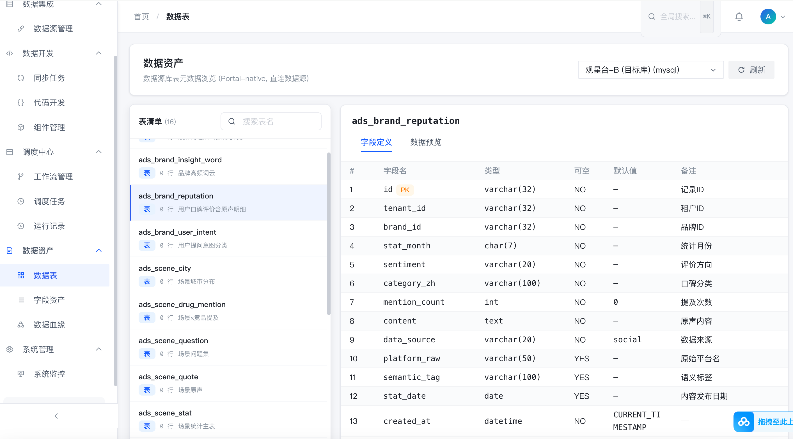

### 系统监控
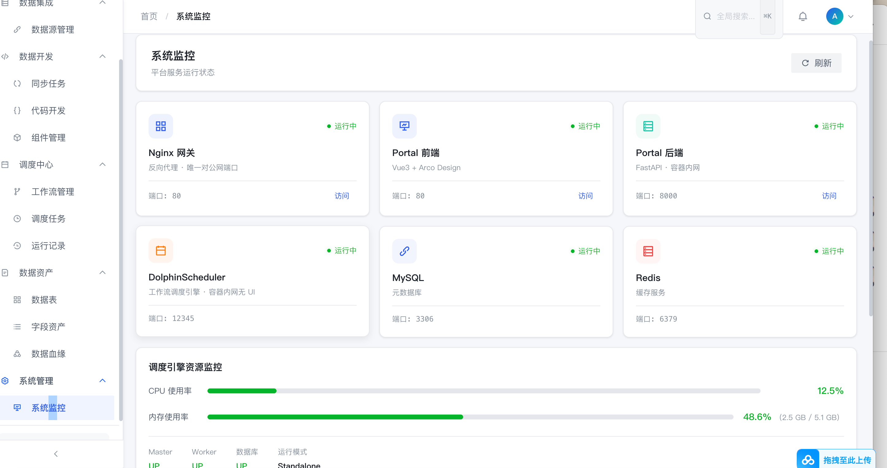

</details>

---

## 技术架构

```
                    Browser
                       │ HTTP :80
              ┌────────▼────────┐
              │     Nginx       │  静态资源 + 反向代理
              └──┬───────┬──────┘
        /api/*   │       │  /openmetadata/*
   ┌─────────────▼─┐  ┌──▼──────────────┐
   │ Portal Backend│  │  OpenMetadata   │
   │   FastAPI     │  │   (数据治理)    │
   └────┬─────┬────┘  └─────────────────┘
        │     │
   ┌────▼─┐ ┌─▼──────────────────┐
   │ MySQL│ │ DolphinScheduler   │──── DataX Jobs
   │ 8.0  │ │ (调度 + 执行引擎)  │
   └──────┘ └────────────────────┘
                 │
            Redis 7 (DS 分布式协调)
```

### 技术栈

| 组件 | 版本 | 职责 |
|---|---|---|
| **Vue 3** + Arco Design | 3.x | 前端 SPA |
| **Monaco Editor** | latest | SQL/Python/Shell 代码编辑器 |
| **FastAPI** | 0.115+ | Portal 后端 REST API |
| **SQLAlchemy** | 2.x | ORM，MySQL 连接 |
| **MySQL** | 8.0 | 元数据库 |
| **Redis** | 7-alpine | DolphinScheduler 分布式协调 |
| **DolphinScheduler** | 3.2.2 | 工作流调度引擎 |
| **DataX** | 3.x | 离线数据同步框架 |
| **OpenMetadata** | latest | 数据治理、血缘追踪 |
| **Elasticsearch** | 7.17 | OpenMetadata 搜索引擎 |
| **Nginx** | 1.25 | 统一入口网关 |

### 项目结构

```
data-platform-mvp/
├── docker-compose.yml          # 全局编排
├── docker/
│   └── mysql/init.sql          # 数据库初始化
├── nginx/
│   └── nginx.conf              # Nginx 路由配置
├── datax/                      # DataX 安装目录 + jobs
├── portal/
│   ├── backend/                # FastAPI 后端
│   │   ├── app/
│   │   │   ├── api/            # 路由层
│   │   │   ├── core/           # 核心逻辑（DataX构建、安全、数据库）
│   │   │   └── models/         # SQLAlchemy 模型
│   │   ├── main.py
│   │   └── requirements.txt
│   └── frontend/               # Vue 3 前端
│       ├── src/
│       │   ├── views/          # 页面
│       │   ├── components/     # 公共组件
│       │   ├── api/index.ts    # 接口封装
│       │   └── router/         # 路由配置
│       └── package.json
└── scripts/                    # 运维脚本
```

---

## 快速开始

### 环境要求

- Docker 24+ & Docker Compose v2
- 服务器 ≥ 8 核 16 GB（DolphinScheduler + OpenMetadata + ES 占用较大）
- 开放端口：`80`（唯一对外端口）

### 一键部署

```bash
# 1. 克隆项目
git clone https://github.com/your-username/data-platform-mvp.git
cd data-platform-mvp

# 2. 配置环境变量
cp .env.example .env
# 编辑 .env，修改所有密码为强密码

# 3. 构建并启动
docker compose up -d --build

# 4. 等待服务就绪（首次约 3-5 分钟）
docker compose ps

# 5. 访问
# Portal: http://<your-ip>
# 默认账号: admin / admin123
# API 文档: http://<your-ip>/docs
```

### 环境变量

复制 `.env.example` 为 `.env`，修改以下变量：

| 变量 | 说明 | 示例 |
|---|---|---|
| `MYSQL_ROOT_PASSWORD` | MySQL root 密码 | `openssl rand -base64 32` |
| `REDIS_PASSWORD` | Redis 密码 | `openssl rand -base64 32` |
| `PORTAL_SECRET_KEY` | JWT 签名密钥（≥32字符） | `openssl rand -base64 32` |
| `DS_ADMIN_PASSWORD` | DolphinScheduler 管理员密码 | `openssl rand -base64 32` |
| `PORTAL_BASE_URL` | 外网访问地址 | `http://your-domain.com` |

> **⚠️ 安全提示**：生产环境部署前请务必阅读 [安全注意事项](#安全注意事项)。

---

## 本地开发

### 后端

```bash
cd portal/backend

# 创建虚拟环境
python -m venv .venv
source .venv/bin/activate  # Windows: .venv\Scripts\activate

# 安装依赖
pip install -r requirements.txt

# 启动服务（需要本地 MySQL）
uvicorn main:app --reload --port 8000

# API 文档
# http://localhost:8000/docs
# http://localhost:8000/redoc
```

### 前端

```bash
cd portal/frontend

# 安装依赖
npm install

# 启动开发服务器
npm run dev

# 构建生产包
npm run build
```

---

## 核心功能

### 数据集成 · 离线同步

- **多数据源**：支持 MySQL，可扩展 PostgreSQL、SQL Server
- **可视化映射**：拖拽式字段映射，支持「常量」「调度变量」
- **增量同步**：支持基于时间戳的增量抽取
- **DataX 驱动**：自动生成标准 DataX JSON 配置
- **状态锁定**：上线后任务不可编辑，防止运行中误改

### 代码开发 · IDE

- **多语言**：SQL / Python / Shell 多标签编辑器
- **智能补全**：关键字、函数、表名、字段名实时补全
- **片段执行**：选中部分 SQL 单独执行
- **文件夹管理**：三级嵌套目录组织脚本
- **一键发布**：脚本发布为「组件」供工作流复用

### 调度中心

- **工作流编排**：基于 DolphinScheduler 的 DAG 可视化编辑
- **定时调度**：CRON 表达式配置
- **补数**：历史日期范围批量重跑
- **日志追踪**：任务执行日志实时查看

### 数据资产

- **表级元数据**：行数、大小、注释、创建时间
- **字段搜索**：跨表字段名搜索
- **血缘图谱**：基于 OpenMetadata 的数据血缘追踪

---

## API 文档

启动服务后访问：

| 环境 | 地址 |
|---|---|
| 本地开发 | http://localhost:8000/docs |
| 生产环境 | http://<your-domain>/docs |

---

## 常见问题

**Q: 首次启动后 DolphinScheduler 无法访问？**

A: DS standalone 模式启动较慢，请等待 2-3 分钟后检查：
```bash
docker logs -f dmp-ds
```

**Q: OpenMetadata 页面空白？**

A: OpenMetadata 初始化需要较长时间（约 3-5 分钟），请等待健康检查通过：
```bash
docker compose ps
```

**Q: DataX 同步任务超时失败？**

A: 当前版本 DataX 执行是同步阻塞模式，大表同步可能超时。建议：
- 控制单次同步数据量（使用 `where_clause` 分批）
- 或等待异步任务队列功能上线（见 [#8](https://github.com/barryLiu199/data-platform-mvp/issues/8)）

**Q: 如何重置 admin 密码？**

A: 直接修改数据库：
```bash
docker exec -it dmp-mysql mysql -uroot -p -e \
  "UPDATE portal_db.sys_user SET password='\$2b\$12\$...' WHERE username='admin';"
```

---

## 设计取舍

| 决策 | 原因 |
|---|---|
| 单节点 DolphinScheduler standalone | 降低运维复杂度，适合中小团队；需高可用时可切换集群模式 |
| Portal 不引入 Redis | 当前无需分布式 Session，JWT 无状态已够用 |
| OpenMetadata 按需集成 | 血缘/治理功能渐进引入，不强依赖 |
| DataX 内置于 DS 容器 | 减少容器数量，DS 与 DataX 版本统一管理 |
| Nginx 唯一对外端口 | 安全隔离，所有内部服务不暴露端口 |

---

## 安全注意事项

> 以下事项在生产环境部署前必须处理：

1. **修改所有默认密码**：`.env` 中的所有密码必须使用强密码（≥16位，含大小写+数字+符号）
2. **配置 HTTPS**：生产环境必须通过 HTTPS 访问，建议使用云厂商负载均衡或 Let's Encrypt
3. **限制 CORS**：修改 `portal/backend/main.py` 中的 `allow_origins`，只允许前端域名
4. **数据源密码加密**：当前版本数据源密码在数据库中明文存储，建议通过 KMS 或环境变量加密存储
5. **移除 Docker Socket 挂载**：如果不需要动态执行 DataX，建议移除 `docker-compose.yml` 中的 `/var/run/docker.sock` 挂载
6. **启用防火墙**：仅开放 80/443 端口，内部服务不对外暴露

详见 [Issues](https://github.com/barryLiu199/data-platform-mvp/issues) 中的安全相关议题。

---

## License

MIT
